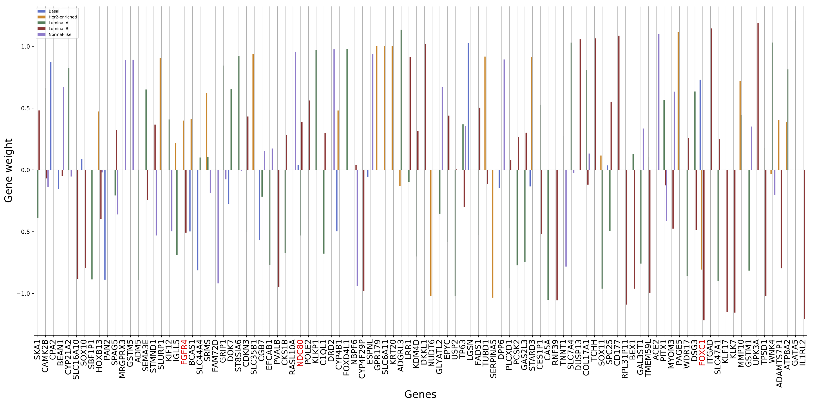

# Comparing classic, deep and semi-supervised learning for whole-transcriptome breast cancer subtyping
Gene expression levels, measuring the transcription activity, are widely used to predict abnormal gene activities, in particular for distinguishing between normal and tumor cells. This problem has been addressed by a variety of machine learning methods; more recently, this problem has been approached using deep learning methods, but they typically failed in meeting the same performance as machine learning. In this paper, we show specific deep learning methods that can achieve similar performance as the best machine learning methods. 

## Data
The data sources that were used for this resworkearch can be found bellow:
* RNA-Seq data from TCGA - https://portal.gdc.cancer.gov
* RNA_Seq data from TCGA (breast cancer subset, labelled by Ciriello et al.) - http://cbio.mskcc.org/cancergenomics/tcga/brca_tcga/
* RNA-Seq data from the ARCHS4 dataset (breast subset): https://amp.pharm.mssm.edu/archs4/download.html

## Source Code
The source code used for the experiments can be found under the "src" directory, with the model classes and scripts to train the models. 
Under "notebooks" one can find several data exploration examples and standalone model experiments for quick prototyping.

## Feature Importance
To give biological meaning to the mathematics behind the models and to bridge the gap between the two major fields of this work (Biology and Computational Intelligence), we decided to analyze and present a visualization of the top 200 genes selected by the Logistic Regression model as being meaningful for the breast cancer subtyping task. 
Such analisys was performed on this model because to its interpretability when compared to the other used models.
The plot of the weight values and its corresponding genes can be found on the 2 plots bellow - the first one containing the 100 genes with the largest weights (in absolute value), and the second one the remaining 100:
### Weights of the top 200 genes overall (1-100)

### Weights of the top 200 genes overall (100-200)

